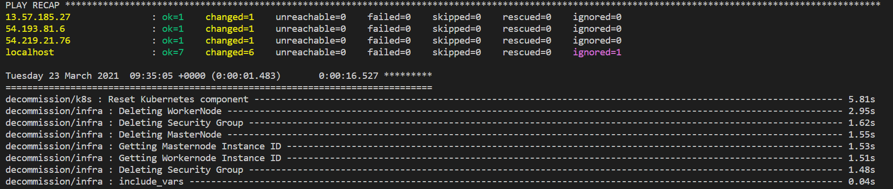

[](https://travis-ci.org/khann-adill/kubernetes-ansible)
[](https://github.com/khann-adill/kubernetes-ansible/actions/workflows/main.yml)
[](https://www.python.org/downloads/)
[](https://ansible-lint.readthedocs.io/en/latest/rules.html#rules)


# Kubernetes Ansible AWS EC2  


A collection of playbooks for deploying a Kubernetes development cluster onto machines, they are fully automated command to bring up a Kubernetes cluster on AWS EC2.

Feature list:
- [x] Support Kubernetes v1.19.0+.
- [x] Highly available development Kubernetes cluster.
- [x] Provisioning AWS EC2 Instances
- [x] Kubernetes addons:
  - [x] Helm.
  - [x] Metrics Server.
  - [x] NFS Dynamic Provisioning. 
  - [x] Kubernetes Dashboard.
  - [x] Logging with ELK
  - [x] Kube State Metric
  - [x] HostPath PV Dynamically provisioning
  - [ ] Monitoring
- [x] Support container network:
  - [x] Calico.
  - [x] Flannel.
- [x] Support container runtime:
  - [x] Docker.
  - [x] Containerd.
  - [x] CRI-O.

## Quick Start
In this section you will deploy a cluster via AWS EC2.

Prerequisites:
* For running this ansible role for privisioning and setting up k8s cluster you need: Ubuntu 18.04 or above or RHEL but I have tested on Ubuntu based machine.
* Clone this Repo
* Need to steup Ansible on local machine.

```yml
$ sh py-ansible.sh
[❗️Updating & Installing Python Latest Version ]
[❗️Installing Ansible ]
[✅ successfully Installed Python3 & Ansible ]
```
* Create AWS IAM User with AdministratorAccess Permissions.
* Add IAM User Access key and Secret key in group_vars/cred.yml using Ansible Vault by using below command.
 Add your Access key & Secret key in cred.yml ansible vault.
 
 ```yml
 $ ansible-vault edit group_vars/cred.yml
 Vault password: 1233
 ```
* `group_vars/cred.yml` ansible vault password was set to `1233`
* To view group_vars/cred.yml using Ansible Vault
```yml
ansible-vault view group_vars/cred.yml
Vault password: 1233
access_key: **********************
secret_key: **************************
```
* To change password for Ansible Vault group_vars/cred.yml
```
ansible-vault rekey  group_vars/cred.yml
Vault password: ***
New Vault password: ***
Confirm New Vault password: ***
Rekey successful
```

### Key Features
Provisioning will create a custom ansible inventory file for setting up k8s cluster.
```yml
$cat /etc/ansible/custom_inv.ini

# This is custom inventory file which will use in setting up k8s cluster
[master]
3.90.3.247 ansible_ssh_private_key_file=/etc/ansible/id_rsa_aws

[worker]
3.89.143.224 ansible_ssh_private_key_file=/etc/ansible/id_rsa_aws

[addnode]
35.173.233.160 ansible_ssh_private_key_file=/etc/ansible/id_rsa_aws

[kube_cluster:children]
master
worker
addnode
```

### Variables
AWS EC2 related Variables, located under group_vars/all.yml
```yml
# To change region.
ec2:
 region: eu-west-1
 
# To change Master Instance type
master:
    vm_type: t2.medium
    
# To change no. of worker nodes and it's types
worker:
    vm_type: t2.micro
    vm_count: 1
```

Set the variables in `group_vars/all.yml` to reflect you need options.
```yml
# kube_version('v1.20.4', 'v1.19.2')
kube_version: v1.20.4

# Supported Network implementation('flannel', 'calico')
network: calico

# Supported container_runtime: ('docker', 'containerd', 'crio')
container_runtime: crio

# Additional feature to install
additional_features:
  helm: false
  nfs_dynamic: true
  metric_server: true
  logging: true
  kube_state_metric: true
  dynamic_hostpath_provisioning: true
  
# Dashboard
enable_dashboard: yes
need_to_save_dashboard_token: yes

# NFS Directory
nfs:
  dir: /nfs-private
```
### Provision AWS EC2 and deploy a Kubernetes cluster
If everything is ready, just run `./aws-k8s.sh` to provision ec2 and deploy the cluster on it:
```sh
$ ./main.sh initcluster
Vault password: 1233
```


## Verify cluster
Verify that you have deployed the cluster, check the cluster as following commands:
```yml
$ kubectl get nodes -o wide

NAME               STATUS   ROLES                  AGE     VERSION   INTERNAL-IP    OS-IMAGE           KERNEL-VERSION   CONTAINER-RUNTIME
kmaster            Ready    control-plane,master   3h28m   v1.20.4   172.31.4.27  Ubuntu 20.04.2 LTS   5.4.0-1038-aws   cri-o://1.20.1
ip-172-31-91-218   Ready    <none>                 3h25m   v1.20.4   172.31.13.91 Ubuntu 20.04.2 LTS   5.4.0-1038-aws   cri-o://1.20.1
...
```

### Adding additional worker nodes to existing k8s cluster
Need to specific how many no. of worker nodes you want to add in group_vars/all.yml
```yml
# Specify the number of worker node you want to add in existing k8s cluster
addnode: 1
```
And run below command:
```sh
$ ./main.sh addnode
Vault password: 1233
```

## Verify cluster after adding additional worker node
Verify that you have added worker nodes, check the cluster as following commands:
```yml
$ kubectl get nodes -o wide

NAME               STATUS   ROLES                  AGE     VERSION   INTERNAL-IP    OS-IMAGE           KERNEL-VERSION   CONTAINER-RUNTIME
kmaster            Ready    control-plane,master   3h28m   v1.20.4   172.31.4.27  Ubuntu 20.04.2 LTS   5.4.0-1038-aws   cri-o://1.20.1
ip-172-31-91-218   Ready    <none>                 3h25m   v1.20.4   172.31.13.91 Ubuntu 20.04.2 LTS   5.4.0-1038-aws   cri-o://1.20.1
ip-172-31-92-95    Ready    <none>                 1h25m   v1.20.4   172.31.25.10 Ubuntu 20.04.2 LTS   5.4.0-1038-aws   cri-o://1.20.1
...
```
### Decommission the AWS infrastructures(Clean Up)
To delete AWS all resouces you need to run below command:
```json
$ ./main.sh reset
Do you want to decommission the AWS resources(y/n):n
Decommission is cancelled by user

$ ./main.sh reset
Do you want to decommission the AWS resources(y/n):y
Vault password: 1233
```
## Verify decommission of AWS resources(Clean Up)


## Show your support

Give a ⭐️ if this project helped you!

## Author

👤 **Adil Abdullah Khan**

[][linkedin]
[][facebook]
[][twitter]
[][instagram]

<br />

[facebook]: https://www.facebook.com/adilabdullah.khan.393
[twitter]: https://twitter.com/adilkhan220496
[instagram]: https://www.instagram.com/khann_adill/
[linkedin]: https://www.linkedin.com/in/adil-abdullah-khan-682075140/
